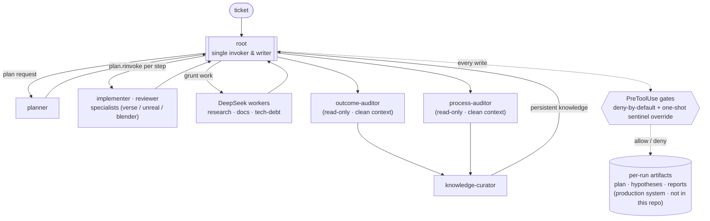

# multiagent-system-lex

[](https://github.com/lexosi/multiagent-system-lex/actions/workflows/ci.yml)

> **Process discipline enforced by hooks, not good faith.**

## What this is

A personal, production multi-agent harness that coordinates debugging and feature work across multiple language/runtime domains (Verse/UEFN, Python, Rust, Java, TypeScript). One main thread ("root") is the only physical invoker of its **19 agents** — 13 Claude reasoners and 6 DeepSeek workers (one a storage-only wrapper). This repository is a **sanitized snapshot** of 17 of those agent definitions plus the enforcement hooks and the compliance-eval findings.

## Not a framework

This repo is **not installable by design**. It is an **architecture reference and a findings write-up of a real system** — absolute paths are replaced with placeholders and the runtime `config/paths.json` is excluded, so it does not run out-of-box. The reusable, packaged piece was extracted into its own project:

➡️ **[loopward](https://github.com/lexosi/loopward)** — the installable reliability layer (anti-loop, human stop-gates, per-run audit trail) pulled out of this system.

## Architecture



Root produces an explicit plan, invokes one specialist per step, collects each report, and decides the next step — subagents never orchestrate each other. Handoff is through on-disk artifacts rather than shared mutable state. Those per-run artifacts (plan, hypotheses, reports) are produced at runtime under `docs/agent_runs/` in the production system and are **not** part of this snapshot; the agent definitions and the enforcement hooks that drive them **are**. The two production agents absent from this public snapshot are not shown as individual nodes.

## Key findings

The enforcement claim is measured, not asserted. Advisory role-discipline rules produced **no measurable behavioral change**; enforcement was redesigned as deny-by-default hooks that prevent the violation by construction. Canonical claim (measured from the enforcement logs over the cutover period):

> After advisory role-discipline rules produced 0/3 compliance in the three runs immediately following the rule's canonization (2026-05-26), enforcement was reimplemented as deny-by-default PreToolUse hooks (cutover 2026-06-01, commit b3efe00 in the production repository — not part of this snapshot, like the logs below). Over the following period (2026-06-02..2026-08-04), every direct root write to planner-owned files hit the gate: all 9 blocked tool-calls across 7 runs; 4 were allowed only through an explicit, logged, one-shot override — 0 unauthorized writes.

The **one-shot flow is the design, not a failure mode**: an unauthorized root write is denied, denied again on retry, and only proceeds after root consumes an explicit, TTL-bounded sentinel override — each step logged. `0 unauthorized writes` is an invariant by construction (the hook denies a guarded territory unless the caller is its owning subagent or consumes a valid one-shot sentinel), corroborated by the logs.

**Where the logs are.** The enforcement logs behind these numbers
(`.deny.log`, `.override.log`) are an operating record of real work on
third-party projects, so they are not published here. A harness that shipped
with its author's own run history would also be carrying luggage nobody else
needs.

They are read by `eval/run_eval.py` in the production system, which derives
the claim above by counting entries rather than restating a number written by
hand. That eval is not part of this snapshot either: it is meaningless without
the logs it reads.

Treat the figures above as a measurement taken on the author's own system over
the stated window, with its method disclosed — not as one you can re-derive
from this repository.

## How to read this repo

| Path | What it holds |
|---|---|
| `config/agents.json` | Roster source of truth — 17 agents, their type (Claude vs DeepSeek wrapper) and tier. |
| `agent_templates/*.md` | Agent system prompts (source of truth); `agent_templates/skills/**` preload domain knowledge per agent. |
| `hooks/*.ps1` | Enforcement layer — `SessionStart` regen, `PreToolUse` deny-by-default guards, reactive `Stop` checks. |
| `scripts/agents/*.py` | Python worker wrappers bridging `Task → Bash → Python` to the secondary LLM provider. |
| `CLAUDE.md` | Project guidance loaded by Claude Code — invariants, session discipline, curated learnings. |

## Design principles

- **Root-driven, single-invoker.** One main thread is the only invoker of subagents; each subagent writes only its own artifact, never shared state or another's territory. Read-only specialists reason and report without touching disk. No subagent-to-subagent orchestration.
- **Enforcement by construction, not good faith.** Discipline lives in `PreToolUse` hooks (deny-by-default + one-shot sentinel override), because advisory rules were measured to produce no behavioral change.
- **Clean-context auditors.** Outcome and process are judged by separate auditors that never touched the audited work and read only raw evidence; each writes only its own report. The executor does not grade its own run.
- **Knowledge files as persistent context.** Curated learnings (`CLAUDE.md`, knowledge base) are the memory that survives across runs; the curator writes them under strict markers only.
- **Model routing by cost.** Reasoning-heavy roles run on the high tier (Opus); high-volume grunt work is delegated to a cheaper secondary provider through thin wrappers.

## Layout

```
agent_templates/   Agent prompts (source of truth) + skills/
config/            agents.json, models.json, kb_tiers.json, triggers.json, paths.example.json
hooks/             SessionStart / PreToolUse / Stop hooks (PowerShell)
scripts/agents/    Python worker wrappers (secondary-provider bridge)
scripts/metrics/   Token-tax instrumentation
docs/architecture/ Model-allocation notes
.claude/           settings.json (hook wiring)
CLAUDE.md          Project guidance loaded by Claude Code
```

## Paths to configure

This snapshot does not run as-is. Two separate things need real locations.

**1. Placeholder tokens** — substituted into hook commands, agent templates and skills. These are **not** keys in `config/paths.json`; they are literal text tokens the docs and hooks carry:

| Token | Meaning | Used in |
|---|---|---|
| `<repo_root>` | Absolute path to **this** repo | hook commands |
| `<knowledge_root>` | Root of your knowledge base | agent templates, `paths-schema.md` |
| `<uefn_root>` | Parent folder of your UEFN projects | `pretooluse-guard-protected-files.ps1` |
| `<projects_root>` | Parent folder of your Blender/asset projects | `session-start-substitute-paths.ps1`, blender skills |
| `<unreal_projects_root>` | Parent folder of your Unreal Editor projects | unreal skills |

**2. Runtime path config** — `config/paths.json`, created from `config/paths.example.json` (gitignored at runtime). Its keys are a separate namespace, documented in [`config/paths-schema.md`](config/paths-schema.md) — don't look for the tokens above as keys there.

Folder-name tokens inside hook regexes (e.g. `UEFNProjects`) are generic examples — adjust them to your real directories. Per-machine overrides are supported via the `MULTIAGENT_PATHS_CONFIG` environment variable.
